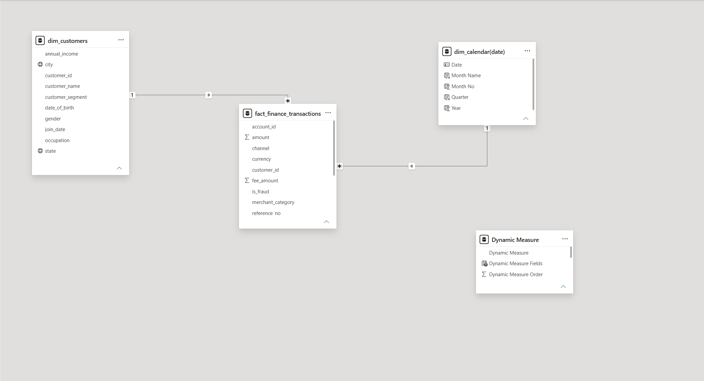
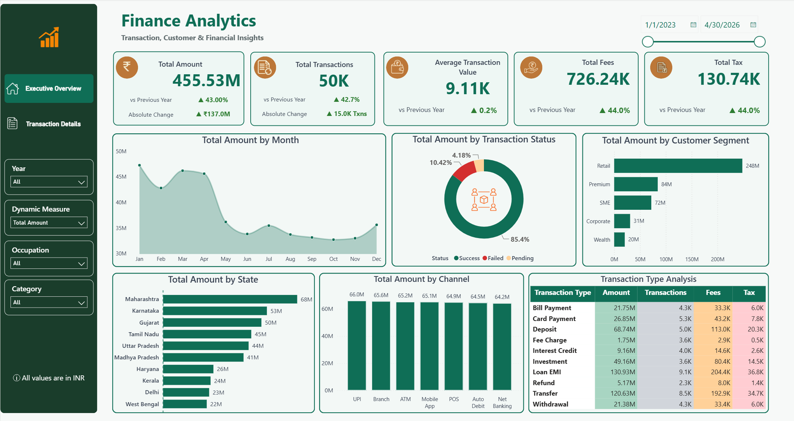
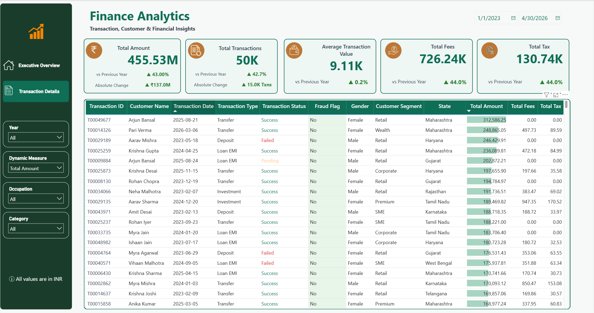

# Finance Analytics Dashboard — Power BI

---

Finance teams often deal with large volumes of transaction data but struggle 
to get quick answers from it. This dashboard helps by giving a clear view of 
where money is moving, which channels are performing, how revenue is growing 
year over year, and which transactions need attention.

Built in Power BI Desktop using real-world finance data with 50,000+ transactions 
spanning 2023 to 2026.

---

## Tech Stack

- Tool: Power BI Desktop
- Language: DAX (Data Analysis Expressions)
- Data Cleaning: Power Query
- Data Modelling: Star Schema (Fact + Dimension tables)
- Charts Used: Area Chart, Donut Chart, Bar Chart, Column Chart, Matrix

---

## Dataset Overview

Two datasets are used in this project:

**Customers Table** — 5,000 rows  
Contains customer name, gender, city, state, occupation, customer segment, and join date.

**Finance Transactions Table** — 50,069 rows  
Contains transaction type, channel, merchant category, amount, fees, tax, 
fraud flag, and transaction status.

---

## Analytics Workflow

Raw CSV Data → Data Cleaning in Power Query → Data Modelling (Star Schema) 
→ DAX Measures → KPI Cards → Charts and Slicers → Dashboard

---

## Data Model

The data model follows a Star Schema with the following tables:

- **fact_finance_transactions** — Central fact table with all transaction records
- **dim_customers** — Customer dimension table
- **dim_calendar** — Date dimension table for time intelligence
- **Dynamic Measure** — A field parameter table that lets users switch between 
Total Amount, Total Transactions, Total Fees, and Total Tax across all charts 
using a single slicer.

---

## Business Requirements

The goal was to build a dashboard that helps finance teams quickly answer these questions:

- How much total revenue, fees, and tax has been collected?
- How is performance changing compared to the previous year?
- Which states and customer segments are contributing the most?
- Which transaction channels are processing the highest volume?
- How are different transaction types performing across amount, fees, tax, and count?
- What percentage of transactions are successful, failed, or pending?
- Which transactions are flagged as fraudulent?
- Who are the highest value customers and what are their transaction details?

---

## Features & Highlights

**Page 1 — Executive Overview**
- 5 KPI cards showing Total Amount, Total Transactions, Average Transaction Value, 
Total Fees, and Total Tax with YoY growth and absolute change
- Dynamic measure slicer that switches all chart titles and values simultaneously
- Total Amount by Month area chart
- Total Amount by Transaction Status donut chart
- Total Amount by Customer Segment bar chart
- Total Amount by State horizontal bar chart
- Total Amount by Channel column chart
- Transaction Type Analysis matrix with per column heatmap conditional formatting
- 4 slicers — Year, Dynamic Measure, Occupation, Category
- Cross filtering across all visuals
- Page navigation buttons

**Page 2 — Transaction Details**
- Detailed transaction table with 11 columns
- Transaction status color badges
- Fraud flag highlighting
- Data bars on Total Amount column
- Drill through from Page 1 charts
- Date range slicer

---

## DAX Measures

This project uses 44 DAX measures organized into 9 groups:

- Base Measures
- Previous Year Measures
- YoY Growth %
- Absolute Change
- Display Measures
- Colour Measures
- Dynamic Measure
- Chart Titles
- Calendar Columns

Full DAX code with explanations is documented here → [dax_measures.md](Documentation/dax_measures.md)

---

## Business Impact & Insights

Here are the key findings from the dashboard:

- Total revenue reached **455.53M** with a strong **43% YoY growth** compared to last year
- Total transactions crossed **50K** with a **42.7% increase** year over year
- **Loan EMI** is the highest contributing transaction type with 130.93M in total amount
- **Maharashtra** leads all states with 68M in total transaction value
- **Retail** segment dominates customer spending with 248M — far ahead of other segments
- **85.4%** of all transactions are successful — showing a healthy transaction completion rate
- All 7 channels show similar volumes around 64M to 66M, meaning no single channel dominates
- **Average transaction value** remained almost flat at 9.11K with only **0.2% YoY change**

---

## Dashboard Preview

**Page 1 — Executive Overview**

**Page 2 — Transaction Details**

---

## Repository Structure
Finance-Analytics-Dashboard-PowerBI/
|
|-- Documentation/
| |-- dax_measures.md
|
|-- Images/
| |-- executive_overview.png
| |-- transaction_details.png
| |-- data_model.png
|
|-- Finance_Analytics_Dashboard.pbix
|-- customers.csv
|-- finance_transactions.csv
|-- README.md

---

## Skills Demonstrated

- Data cleaning and transformation in Power Query
- Star schema data modelling in Power BI
- DAX measures for KPIs, YoY growth, and time intelligence
- Dynamic measure switching using field parameters
- Conditional formatting with heatmaps and color scales
- Cross filtering and drill through between pages
- Professional dashboard design and layout

---

## Author

**Surajit Aich**  
[LinkedIn](https://www.linkedin.com/in/surajit-aich-a25651229/)  
[GitHub](https://github.com/surajit-aich)

---

## Disclaimer

The dataset used in this project is synthetic and created for learning 
and portfolio purposes only. It does not represent any real financial 
institution or actual transaction data.
